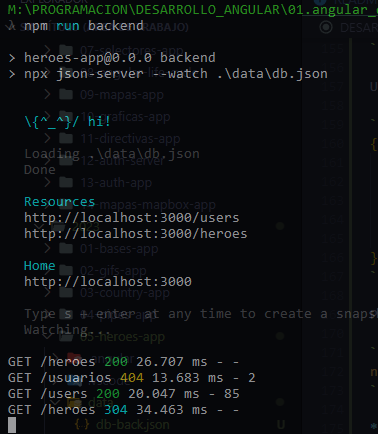
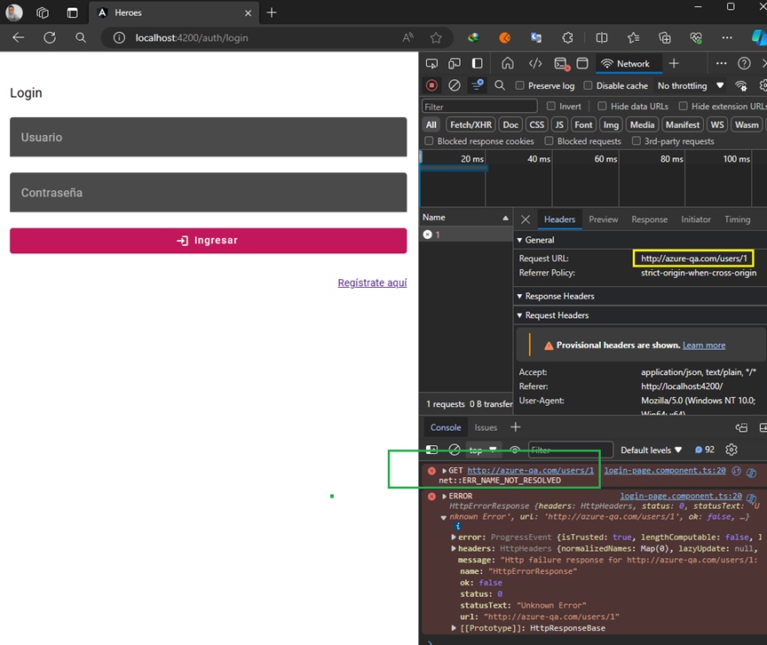
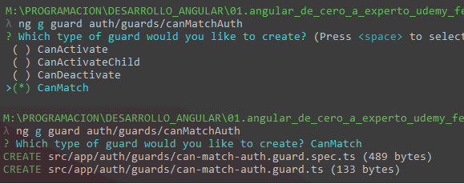
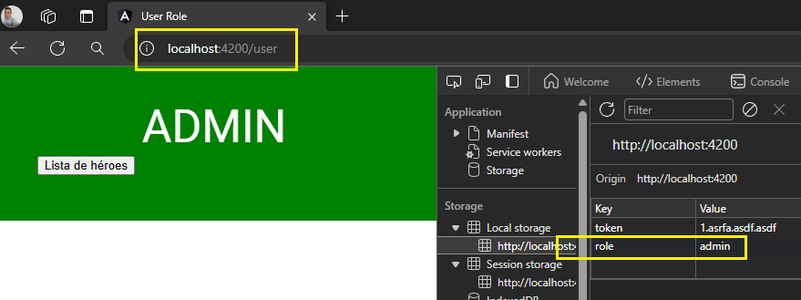
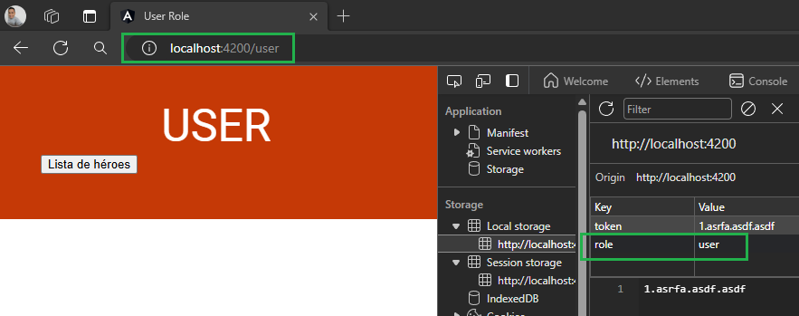
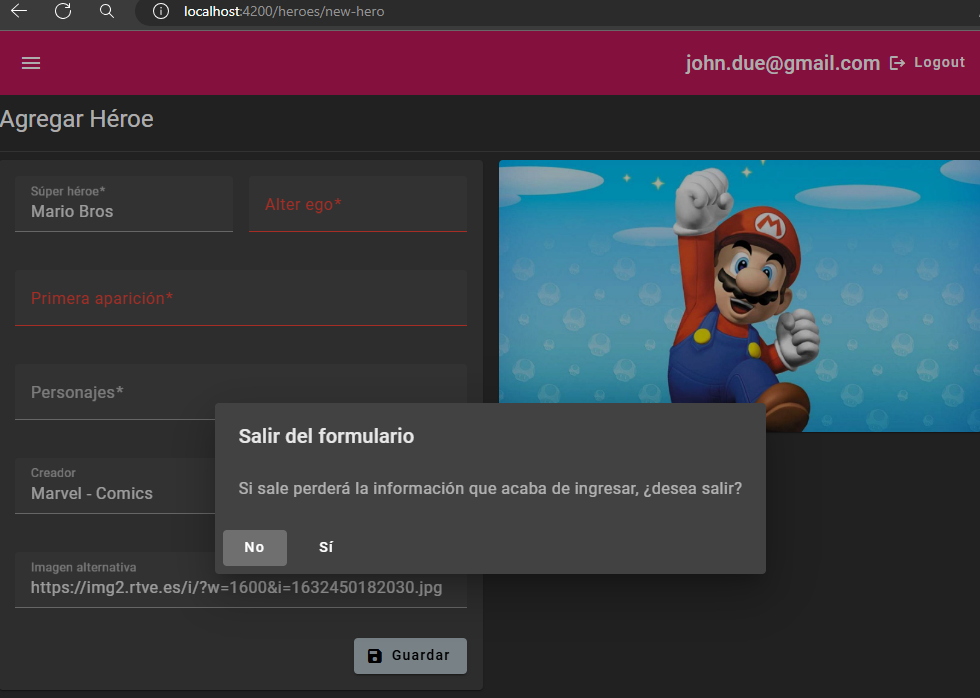
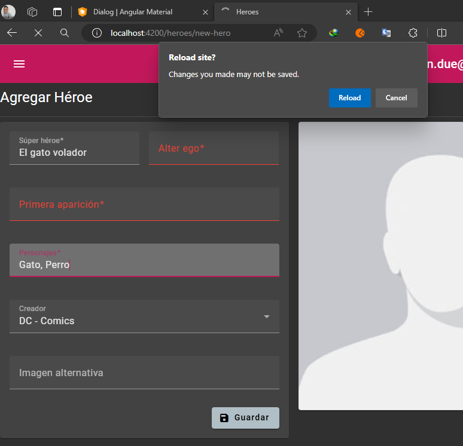

# HeroesApp

This project was generated with [Angular CLI](https://github.com/angular/angular-cli) version 16.0.1.

---


# Sección: Rutas hijas y LazyLoading

En el **AppRoutingModule** definimos nuestras rutas principales aplicando **LazyLoad**. Únicamente aplicaremos **LazyLoad** al módulo de **Auth** y al **Heroes**, mientras que el módulo **Shared**  será importado directamente en el **AppModule**, de esa forma utilizaremos los componentes definidos en el **Shared** de manera directa, tal como sucede con el componente **Error404PageComponent**.

```typescript
const routes: Routes = [
  {
    path: 'auth',
    loadChildren: () => import('./auth/auth.module').then(m => m.AuthModule), //<-- Aplicando LazyLoad
  },
  {
    path: 'heroes',
    loadChildren: () => import('./heroes/heroes.module').then(m => m.HeroesModule), //<-- Aplicando LazyLoad
  },
  {
    path: '404',
    component: Error404PageComponent, // <-- Agregando componente directo
  },
  //* www.my-web-site.com/ <--- '', pero debo ponerle el pathMatch='full' ya que por defecto
  //* todas las rutas tienen un string vacío al inicio
  { path: '', redirectTo: '/heroes', pathMatch: 'full', }, 
  { path: '**', redirectTo: '/404', }
];

@NgModule({
  imports: [RouterModule.forRoot(routes)],
  exports: [RouterModule]
})
export class AppRoutingModule { }
```

**IMPORTANTE**

- `Ruta principal:` En el caso de la ruta principal, al usar `redirectTo`, se debe especificar la ruta completa **(ruta absoluta)**, incluyendo el `/`, ya que **la redirección se realiza a nivel de la raíz de la aplicación.**, por ejemplo: ` { path: '', redirectTo: '/heroes', pathMatch: 'full', },`

- `Rutas hijas:` Cuando se define el `redirectTo` en las rutas hijas, la redirección debe ser **relativa** al contexto de la ruta actual. Por lo tanto, no es necesario incluir el `/` al especificar la redirección. Esto se debe a que las rutas hijas ya están anidadas dentro de una ruta principal y la redirección debe ser relativa a esa ubicación. Veamos el siguiente ejemplo que ilustra lo mencionado `{ path: '**', redirectTo: 'login', },`:

```typescript
const routes: Routes = [
  {
    path: '',
    component: LayoutPageComponent,
    canActivate: [canActivateAuthGuard],
    children: [
      { path: 'login', component: LoginPageComponent, },
      { path: 'register', component: RegisterPageComponent, },
      { path: '**', redirectTo: 'login', },
    ]
  }
];

@NgModule({
  imports: [RouterModule.forChild(routes)],
  exports: [RouterModule]
})
export class AuthRoutingModule { }
```

Sin embargo, si en las rutas hijas, en el `redirectTo` usamos el `/`, estaríamos indicando que es una ruta raíz de la aplicación **(ruta absoluta)**. Por ejemplo, veamos ahora cómo quedaría el `redirectTo` con el `/`:

```typescript
const routes: Routes = [
  {
    path: '',
    component: LayoutPageComponent,
    canActivate: [canActivateAuthGuard],
    children: [
      { path: 'login', component: LoginPageComponent, },
      { path: 'register', component: RegisterPageComponent, },
      { path: '**', redirectTo: '/auth/login', },
    ]
  }
];

@NgModule({
  imports: [RouterModule.forChild(routes)],
  exports: [RouterModule]
})
export class AuthRoutingModule { }
```

Observamos que, para que funcione el `redirectTo` en estas rutas hijas, necesitamos redirigir de manera absoluta especificando toda la ruta completa `{ path: '**', redirectTo: '/auth/login', }`

## pathMatch: 'full'

Observamos que en las rutas principales definidas en la sección superior, nuestra ruta vacía tiene la propiedad **pathMatch: 'full'**:

```javascript
{ path: '', redirectTo: '/heroes', pathMatch: 'full', }
```

**CONSIDERACIONES**

- **El path vacío ''** hace referencia a la **raíz de nuestro dominio**: Ejmp. www.my-web-site.com
- **Una ruta vacía es un prefijo de cualquier URL**, eso significa que por ejemplo nuestra ruta **auth**, **heroes**, etc. tienen como prefijo
  una ruta vacía.
- **Todas las rutas** tienen **por defecto** el **pathMatch en 'prefix'**.
- A nuestra ruta vacía (raíz del dominio) le agregamos la propiedad  **pathMatch: 'full'** para decirle que para acceder a esta ruta, el usuario debe escribir en el navegador exactamente tal cual está definida aquí, en pocas palabras escribir la raíz del dominio.


**El pathMatch**, es una estrategia que determina si una url pertenece o no a una ruta.
El atributo pathMatch, puede tomar 2 valores: **full o prefix:**

- **full**, debe coincidir la ruta completa con la URL completa. **Se aplica a la ruta vacía,** ya que la misma es un prefijo de cualquier URL y puede provocar un bucle sin fin.
- **prefix (por defecto)**, significa que se elige la primera ruta donde la ruta coincide con el inicio de la URL, pero luego el algoritmo de coincidencia de ruta continúa buscando rutas secundarias coincidentes donde coincide el resto de la URL.


Con el **pathMatch 'full'** estamos indicándole a angular **que solo entre a esa ruta si el path es exactamente ese, ni más ni menos.** Si no es exactamente ese, no entra. **¿Por qué esto?** Bueno, el **comportamiento por defecto es pathMach: 'prefix'**, que este básicamente busca de izquierda a derecha, y cuando la ruta haga match con el path (aunque pueda no ser la ruta completa) entrará. También ten en cuenta cómo declaramos las rutas, y que estas se leen de arriba hacia abajo. Si tienes una ruta que siempre se cumpla sin el pathMatch: 'full', aunque abajo de esta tengas otra ruta declarada con un path más específico, no entrará a esa, porque en la primera que entra se queda, no busca más. De ahí que o uses pathMatch: 'full', o declares las rutas de la más específica a la menos.

## Paths de las rutas faltantes

Construimos las rutas hijas, en este caso la de **heroes**:

```typescript
const routes: Routes = [
  {
    path: '',
    component: LayoutPageComponent,
    children: [
      { path: 'new-hero', component: NewPageComponent, },
      { path: 'search', component: SearchPageComponent, },
      { path: 'edit/:id', component: NewPageComponent, },
      { path: 'list', component: ListPageComponent, },
      { path: ':id', component: HeroPageComponent, }, //<-- Es importante que este vaya casi al final
      { path: '**', redirectTo: 'list', },
    ],
  }
];

@NgModule({
  imports: [RouterModule.forChild(routes)],
  exports: [RouterModule]
})
export class HeroesRoutingModule { }
```

**NOTA**
> Es importante tener en cuenta el orden que le definamos a las rutas. En el ejemplo anterior, observemos el path
> **:id** se encuentra definido de manera intencional casi al final de las rutas, esto debido a que si lo definimos, 
> por ejemplo como primer elemento del conjunto de rutas, cualquier otra ruta a la que queramos ingresar, por ejemplo
> la ruta **search**, se detendrá en nuestra ruta **:id** (que en este ejemplo está como primer elemento), porque tomará 
> el path **search** como si fuera el **id** que espera, por eso lo definimos casi al final.

---

# Sección: Angular Material


## Instalación de [Angular Material](https://material.angular.io/guide/getting-started)


- Comenzaremos instalando **Angular Material**, para eso ejecutamos el siguiente comando:

```bash
ng add @angular/material
```
- Luego de verificar nos pedirá que elijamos un tema, yo eligiré: **Pink/Blue Grey**, aunque también está el **Custom** para hacerlo más personalizado.
- Luego nos preguntará ¿Configurar estilos tipográficos globales de material angular?, de damos en **Yes**
- Finalmente, nos preguntará si ¿incluir el módulo de animaciones angulares?, seleccionamos **Include and enable animation**

## Instalando [Primeflex css](https://primeflex.org/installation)

PrimeFlex es una biblioteca de utilidades CSS que presenta varios helpers, como un sistema de cuadrícula, flexbox, espaciado, elevación y más.
PrimeFlex es una biblioteca de utilidades de CSS liviana y receptiva **que acompaña a las bibliotecas Prime UI** y también a las páginas web estáticas.
Recordemos que **es el mismo que utilizamos en el proyecto de pipes-app**.

Ejecutar el siguiente comando en nuestro proyecto de Angular

```bash
npm install primeflex
```
Luego de la instalación incluir la librería agregándola desde el **angular.json**

```json
"styles": [
  "...",
  "node_modules/primeflex/primeflex.min.css",
  "..."
],
```
**NOTA**
> Otra forma de instalarlo es cargándolo mediante un CDN: <br>
> ``<link rel="stylesheet" href="https://unpkg.com/primeflex@latest/primeflex.css">``

## Íconos para Angular Material

Ir a esta dirección [fonts.google](https://fonts.google.com/icons?selected=Material+Icons:bookmark)

## Heroes Backend - json-server

En este punto del curso necesitamos un backend que nos proporcione endpoints para poder crear nuestra aplicación de héroes: listar, leer, eliminar, crear, etc. Para poder realizar este backend nos ayudaremos de una dependencia llamada **json-server**  y los datos los ubicaremos en un archivo llamado **db.json**.

### Datos a Usar como Base de Datos en db.json para nuestro "Backend"

Crearemos un .json con un conjunto de datos que simularán nuestros datos de héroes que serán usados por nuestro **backend** para ser enviados a nuestra aplicación de Angular.

En nuestro proyecto de **Angular** creamos un directorio llamado **/data** y dentro de él un archivo llamado **db.json** conteniendo datos de héroes y usuarios. Para ver los datos [visitar el siguiente enlace](https://gist.github.com/Klerith/e09f16f2ae9f6c9ebce6c648fc136072). Crearemos además otro archivo **db-back.json** para tener los datos originales respaldados.


### [json-server](https://www.npmjs.com/package/json-server)

Obtenga una API REST falsa completa sin codificación en menos de 30 segundos.

Para poder instalarlo, los creadores de esta dependencia nos recomiendan hacerlo de manera global **(-g)**, pero en nuestro caso lo haremos de manera local, dentro de nuestra aplicación de Angular y solo en nuestras dependencias de desarrollo (no estará disponible en las dependencias de producción), por lo tanto, abrimos una consola, nos ubicamos en nuestro proyecto y ejecutamos el siguiente comando:

````bash
npm install --save-dev json-server
````

Una vez finalizada la instalación de **json-server** veremos que el nombre de la dependencia se registró en las dependencias de desarrollo dentro del **package.json:**

````javascript
{
  "devDependencies": {
    "...",
    "json-server": "^0.17.3", //<-- Disponible en modo de desarrollo
    "..."
  }
}
````

Para ejecutar nuestro **json-server**, posicionados mediante la consola en la raiz del proyecto de angular, utilizaremos el siguiente comando:

````bash
npx json-server --watch .\data\db.json
````

**NOTA** en versiones anteriores se ejecutaba: ``json-server --watch db.json``, mientras que ahora hay que agregarle el prefijo **npx** sino no se ejecutará.

Como alternativa a ejecutar todo el comando mostrado del **json-server** podemos utilizar el **package.json** para poder crearnos un script de comandos más corto **(precisamente esta es la forma que usaré)**, para eso en el **package.json** agregamos nuestro comando:

````javascript
{
  "name": "heroes-app",
  "version": "0.0.0",
  "scripts": {
    "backend": "npx json-server --watch .\\data\\db.json", //<-- Nuestro nuevo comando más corto es: backend
    "..."
  }
}
````

Ahora, para poder ejecutarlo, simplemente posicionados en la raíz del proyecto ejecutamos:

````bash
npm run backend
````

Como resultado tenemos lo que se muestra en la imagen:



## [Environments - Angular 15+](https://angular.io/guide/build#configuring-application-environments)

Desde la versión 15 ya no vienen por defecto el directorio **/environments** donde definíamos en sus archivos nuestras variables de entorno. Para poder crearlas simplemente ejecutamos el siguiente comando:

````bash
ng generate environments
````

Se nos crearán los siguientes archivos:

```bash
CREATE src/environments/environment.ts
CREATE src/environments/environment.development.ts
UPDATE angular.json
```
Dado que estamos trabajando en desarrollo, la url de la api que estamos consumiendo (en nuestro caso la **URL del json-server**), lo configuramos en el archivo **environment.development.ts**:

````javascript
// environment.development.ts
export const environment = {
  apiUrl: 'http://localhost:3000',
};
````

Mientras que el archivo **environment.ts** lo dejamos vacío, ya que este archivo corresponde a un archivo de producción, eso significa que cuando construyamos el proyecto para producción, aquí debería ir la **URL** real, url del cual nuestra aplicación consumira en producción y al momento de construir la aplicación, angular tomará la url de este archivo:

````javascript
// environment.ts
export const environment = {
  apiUrl: '',
};
````

## Agregando Environments

Para agregar nuevos environments debemos crear un archivo de typescript y configurar el `angular.json` además de agregar scripts en el `package.json`.

1. Creamos el archivo que definirá environments para el entorno de `qa`. Este archivo debemos crearlo en el directorio `/environments`:

```typescript
// environment.qa.ts
export const environment = {
  apiUrl: 'http://azure-qa.com',
};
```

2. Como segundo paso, debemos configurar el archivo creado en el paso anterior dentro del `angular.json`. En la sección `build` dentro de `configurations` veremos dos entornos configurados por defecto (production y development); nosotros copiaremos las configuraciones que se han definido para el `development` y lo pegamos a continuación renombrándolo a `qa` (será el nombre del environment) las partes donde dicen `development`:

```json
"build": {
  "builder": "@angular-devkit/build-angular:browser",
  "options": {
    ...
  },
  "configurations": {
    "production": {
      "budgets": [
        {
          "type": "initial",
          "maximumWarning": "500kb",
          "maximumError": "1mb"
        },
        {
          "type": "anyComponentStyle",
          "maximumWarning": "2kb",
          "maximumError": "4kb"
        }
      ],
      "outputHashing": "all"
    },
    "development": {
      "buildOptimizer": false,
      "optimization": false,
      "vendorChunk": true,
      "extractLicenses": false,
      "sourceMap": true,
      "namedChunks": true,
      "fileReplacements": [
        {
          "replace": "src/environments/environment.ts",
          "with": "src/environments/environment.development.ts"
        }
      ]
    },
    "qa": {
      "buildOptimizer": false,
      "optimization": false,
      "vendorChunk": true,
      "extractLicenses": false,
      "sourceMap": true,
      "namedChunks": true,
      "fileReplacements": [
        {
          "replace": "src/environments/environment.ts",
          "with": "src/environments/environment.qa.ts"
        }
      ]
    }
  },
  "defaultConfiguration": "production"
}
```


3. Como siguiente paso, debemos agregar una nueva configuración en la sección de `serve` para poder desplegarlo de manera local. En esta sección también observamos los dos entornos que vienen por defecto (production y development), así que volvemos a copiar y pegar la configuración del development y lo renombramos a `qa`:

```json
"serve": {
  "builder": "@angular-devkit/build-angular:dev-server",
  "configurations": {
    "production": {
      "browserTarget": "heroes-app:build:production"
    },
    "development": {
      "browserTarget": "heroes-app:build:development"
    },
    "qa": {
      "browserTarget": "heroes-app:build:qa"
    }
  },
  "defaultConfiguration": "development"
},
```

4. Ya casi para finalizar, necesitamos crear un script para que nos facilite la ejecución de la aplicación de manenra más sencilla en el nuevo entorno que hemos agregado, así que en el `package.json` agregamos el siguiente script dentro de la sección de `scripts`. El nombre que debemos agregarle después de la bandera `--configuration` es el nombre que le hayamos asignado al nuevo environment dentro de la sección `configurations` del archivo `angular.json`. En nuestro caso lo definimos como `qa`.

```json
"scripts": {
  "backend": "npx json-server --watch .\\data\\db.json",
  "ng": "ng",
  "start": "ng serve",
  "build": "ng build",
  "watch": "ng build --watch --configuration development",
  "test": "ng test",
  "qa-dev": "ng serve --configuration qa"
},
```

5. Ejecutando aplicación con el nuevo environment agregado:

```bash
$ npm run qa-dev

> heroes-app@0.0.0 qa-dev
> ng serve --configuration qa

√ Browser application bundle generation complete.

Initial Chunk Files                            | Names                |  Raw Size
vendor.js                                      | vendor               |   2.51 MB |
styles.css, styles.js                          | styles               | 691.26 kB |
polyfills.js                                   | polyfills            | 333.16 kB |
main.js                                        | main                 |  18.36 kB |
runtime.js                                     | runtime              |  12.62 kB |

                                               | Initial Total        |   3.54 MB

Lazy Chunk Files                               | Names                |  Raw Size
default-src_app_material_material_module_ts.js | auth-auth-module     |   2.42 MB |
src_app_heroes_heroes_module_ts.js             | heroes-heroes-module |  71.99 kB |
src_app_auth_auth_module_ts.js                 | auth-auth-module     |  17.44 kB |

Build at: 2024-05-13T23:13:23.894Z - Hash: 24408d5ac82fa107 - Time: 7677ms

** Angular Live Development Server is listening on localhost:4200, open your browser on http://localhost:4200/ **


√ Compiled successfully.
```

Si ejecutamos la aplicación, vemos que ahora la llamada se está haciendo a la url que configuramos en nuestro nuevo entorno:



## HeroesService - Traer información de los héroes

Por lo general nuestras variables de entorno los usaremos en los **Services**. **La importación la debemos hacer del archivo de producción**, Angular sabe en qué ambiente nos encontramos, es decir, aunque ahora mismo estoy desarrollando me encuentro en ambiente de desarrollo, también el api del **json-server** está en el archivo **environment.development.ts**, pero la importación la debemos hacer del archivo **environment.ts** (el de producción) aunque este tenga el atributo **urlApi** vacío, como estamos desarrollando, Angular tomará el del archivo **environment.development.ts**.

````javascript
import { environment } from '../../../environments/environment'; //<--- Importando el archivo de producción
import { Hero } from '../interfaces/hero.interface';


@Injectable({
  providedIn: 'root'
})
export class HeroesService {

  private readonly apiUrl: string = environment.apiUrl;

}
````

---


# Sección: Protección de rutas

---

## AuthService - Servicio de Authenticación

En este capítulo hay un momento que se habla de la referencia de objetos en Javascript y el **uso del método global structuredClone()**.

### structuredClone()

El método global structuredClone() **crea un clon profundo de un valor dado utilizando el algoritmo de clonación estructurada.**

El método también permite que los objetos transferibles en el valor original se transfieran en lugar de clonarse al nuevo objeto. Los objetos transferidos se separan del objeto original y se adjuntan al nuevo objeto; ya no son accesibles en el objeto original.

El valor devuelto es una copia profunda del valor original.

Una copia profunda crea un nuevo objeto con su propio conjunto de datos, separado del objeto original. Esto significa que **si se modifica el objeto original, la copia no se verá afectada.**

Anteriormente, usábamos el **Spread operator** para realizar copias superficiales de objetos, **lo que significa que crea un nuevo objeto y copia las propiedades enumerables de un objeto a otro,** manteniendo el mismo nivel de profundidad. El objeto copiado será un objeto independiente con las mismas propiedades y valores que el objeto original. Cualquier modificación en el objeto original no afectará al objeto copiado y viceversa, ya que son objetos diferentes en memoria: Ejempo usando el operador **Spread operator**: ``{...user}``. 

Ahora, **de forma nativa, javascript ya nos proporciona un método para hacer lo mismo y mucho mejor pues la copia es profunda**, hablo del uso del método global **structuredClone()**

## Guards de Angular

Anteriormente **se trabajan los Guards en clases que eran servicios** que implementaban **interfaces**. A continuación se muestra de manera breve la forma de cómo se hacía:

````typescript
import { Injectable } from '@angular/core';
import { ActivatedRouteSnapshot, CanActivate, CanLoad, Route, RouterStateSnapshot, UrlSegment, Router } from '@angular/router';
import { Observable, tap } from 'rxjs';

import { AuthService } from '../services/auth.service';

@Injectable({
  providedIn: 'root'
})
export class AuthGuard implements CanLoad, CanActivate {

  constructor(private authService: AuthService, private router: Router) { }

  canActivate(route: ActivatedRouteSnapshot, state: RouterStateSnapshot): Observable<boolean> | Promise<boolean> | boolean {
    return this._isAuthenticated();
  }

  canLoad(route: Route, segments: UrlSegment[]): Observable<boolean> | Promise<boolean> | boolean {
    return this._isAuthenticated();
  }

  private _isAuthenticated(): Observable<boolean> {
    return this.authService.verifyAuthentication()
      .pipe(
        tap(isAuthenticate => {
          if (!isAuthenticate) {
            this.router.navigate(['./auth', 'login'])
          }
        })
      );
  }
}
````

Actualmente, estas interfaces están deprecadas ya que ahora se está orientado al uso de tipo de funciones. `CanActivateFn, CanActivateChildFn, CanDeactivateFn, CanMatchFn`, etc., es decir, no necesitamos crear una clase sino solo con funciones. Más adelante veremos el ejemplo.

Para poder crear Guards desde Angular CLI podemos ejecutar el siguiente comando ``ng g guard mi-guard`` tal como se muestra en la imagen inferior.



**NOTA**

> Anteriormente se podía elegir más de un tipo de guard y el CLI los creaba, pero ahora, al momento de ejecutar
> el comando de la creación del guard, solo podemos elegir uno por archivo de creación. Si seleccionamos más de
> una opción, Angular CLI nos mostrará un error. Pero es solo para la creación del archivo junto a nuestro
> método guard. Si queremos utilizar un único archivo que contenga más de un Guard, podemos crearlos por separado
> y luego lo unimos, tal como lo hice yo en esta sección.


## ¿Qué son los Guards?

**[Fuente: Angular.io](https://angular.io/guide/router-tutorial-toh#milestone-5-route-guards)**

Son elementos que se utilizan para **controlar el acceso a ciertas rutas en una aplicación web.** Los guards son una característica importante de Angular que **permite proteger y controlar la navegación en función de ciertas condiciones**, es decir, a veces necesita controlar el acceso a diferentes partes de su aplicación por varias razones, algunas de las cuales pueden incluir las siguientes:

- Quizás el usuario no esté autorizado para navegar hasta el componente de destino.
- Tal vez el usuario debe iniciar sesión primero (autenticarse).
- Tal vez debería obtener algunos datos antes de mostrar el componente de destino.
- Es posible que desee guardar los cambios pendientes antes de abandonar un componente.
- Puede preguntarle al usuario si está bien descartar los cambios pendientes en lugar de guardarlos.

``El valor de retorno de un guard controla el comportamiento del enrutador:``

- **true**, el proceso de la navegación continúa.
- **false**, el proceso de la navegación se detiene y el usuario se queda quieto.
- **UrlTree**, Se cancela la navegación actual y se inicia una nueva navegación al UrlTree devuelto.


**El router** admite varios métodos de protección:

- **canActivate**, para mediar la navegación a una ruta.
- **canActivateChild**, para mediar la navegación a una ruta secundaria.
- **canDeactivate**, para alejar la navegación de la ruta actual.
- **resolve**, para realizar la recuperación de datos de ruta antes de la activación de la ruta.
- **canMatch**, para controlar si se debe usar una ruta, incluso si la ruta coincide con el segmento de URL.

**Con la excepción de canMatch**, si algún guardia devuelve falso, **los guardias pendientes que no se han completado se cancelan** y se cancela toda la navegación. **Si un protector canMatch devuelve falso**, el **router continúa procesando el resto de las rutas** para ver si una configuración de ruta diferente coincide con la URL.

## canActivate: requiere autenticación
Las aplicaciones a menudo restringen el acceso a un área de funciones en función de quién es el usuario. Puede permitir el acceso solo a usuarios autenticados o a usuarios con un rol específico. Puede bloquear o limitar el acceso hasta que se active la cuenta del usuario.

**El guard canActivate** es la herramienta para administrar estas reglas comerciales de navegación.

## canMatch: protección del acceso no autorizado a los módulos de funciones

Si observamos el HeroesRoutingModule, veremos que ya estamos protegiendo nuestro  HeroesModule con un guard canActivate que evita que los usuarios no autorizados accedan a las páginas de los héroes (list, new-hero, search, etc.). Redirige a la página de inicio de sesión si el usuario no está autorizado o como en nuestro cas, no está logueado.

**Pero el router sigue cargando HeroesModule incluso si el usuario no puede visitar ninguno de sus componentes.** Idealmente, solo cargaría HeroesModule si el usuario ha iniciado sesión. En resumen, si la validación de los guards **canMatch** devuelven falso, **el módulo nunca se va a cargar.**

``NOTA: esta característica es similar a la que usaba el canLoad que ahora ya se encuentra deprecado y se recomienda hacer uso del canMatch en su reemplazo``.

Un guard canMatch controla si el enrutador intenta hacer coincidir una ruta. Esto le permite tener varias configuraciones de ruta que comparten la misma ruta pero se combinan en función de diferentes condiciones. Este enfoque permite que el enrutador coincida con la ruta comodín en su lugar.

## CanDeactivate: comprueba cambios no guardados antes de salir de la ruta

Evitar que los usuarios abandonen una ruta puede evitar que pierdan su progreso en un formulario o algo similar. Angular lo hace fácil con CanDeactivate Guard, y es aún más sencillo escribir con el formato (ya no tan nuevo) de Guards funcionales.

## Creando guards canMatch y canActivate para rutas heroes y auth

En este apartado trabajaremos con los guards `canMatch` y `canActivate`:

Creamos los guards **CanMatchFn** y **CanActivateFn** para la ruta **heroes**.

````typescript
import { CanActivateFn, CanMatchFn, Router } from '@angular/router';
import { inject } from '@angular/core';
import { Observable, tap } from 'rxjs';

import { AuthService } from '../services/auth.service';


export const canMatchHeroesGuard: CanMatchFn = (route, segments) => {
  console.log('CanMatch Heroes');
  return checkAuthStatus();
};

export const canActivateHeroesGuard: CanActivateFn = (route, state) => {
  console.log('CanActivate Heroes');
  return checkAuthStatus();
};

const checkAuthStatus = (): Observable<boolean> => {
  const router = inject(Router);
  const authService = inject(AuthService);
  return authService.checkAuthentication()
    .pipe(
      tap(isAuthenticated => console.log("¿está autenticado?: " + isAuthenticated)),
      tap(isAuthenticated => {
        if (!isAuthenticated) {
          router.navigate(['/auth', 'login']);
        }
      }),
    );
}
````

Creamos los guards **CanMatchFn** y **CanActivateFn** para la ruta **auth**.

````typescript
import { CanActivateFn, CanMatchFn, Router } from '@angular/router';
import { inject } from '@angular/core';
import { tap, map, Observable } from 'rxjs';

import { AuthService } from '../services/auth.service';

export const canMatchAuthGuard: CanMatchFn = (route, segments) => {
  console.log('CanMatch Auth');
  return checkAuthStatus();
};

export const canActivateAuthGuard: CanActivateFn = (route, state) => {
  console.log('CanActivate Auth');
  return checkAuthStatus();
};

const checkAuthStatus = (): Observable<boolean> => {
  const router = inject(Router);
  const authService = inject(AuthService);
  return authService.checkAuthentication()
    .pipe(
      tap(isAuthenticated => console.log("¿está autenticado?: " + isAuthenticated)),
      tap(isAuthenticated => {
        if (isAuthenticated) {
          router.navigate(['./heroes', 'list']);
        }
      }),
      map(isAuthenticate => !isAuthenticate) //* Si no está autenticado retornamos true para que pueda ingresar al login
    );
}
````

## Usando canMatch y canActivate para proteger las rutas de heroes y auth

El siguiente fragmento de código corresponde a las rutas principales del proyecto y si observamos, estamos trabajando con **LazyLoading**, por lo tanto, aquí utilizaremos el método de protección **canMatch**, de esta manera, como lo explicábamos en la parte superior, **si el guard retorna un false, el módulo nunca será cargado:**

````typescript
/* other imports */
import { canMatchHeroesGuard } from './auth/guards/heroes.guard';
import { canMatchAuthGuard } from './auth/guards/auth.guard';

const routes: Routes = [
  {
    path: 'auth',
    loadChildren: () => import('./auth/auth.module').then(m => m.AuthModule),
    canMatch: [canMatchAuthGuard],
  },
  {
    path: 'heroes',
    loadChildren: () => import('./heroes/heroes.module').then(m => m.HeroesModule),
    canMatch: [canMatchHeroesGuard],
  },
  {
    path: '404',
    component: Error404PageComponent,
  },
  { path: '', redirectTo: 'heroes', pathMatch: 'full', },
  { path: '**', redirectTo: '404', }
];

@NgModule({
  imports: [RouterModule.forRoot(routes)],
  exports: [RouterModule]
})
export class AppRoutingModule { }
````

Ahora, para los módulos que contienen las rutas hijas, utilizaremos el método de protección **canActivate**:

````typescript
/* other code */
const routes: Routes = [
  {
    path: '',
    component: LayoutPageComponent,
    canActivate: [canActivateHeroesGuard],
    children: [
      { path: 'new-hero', component: NewPageComponent, },
      { path: 'search', component: SearchPageComponent, },
      { path: 'edit/:id', component: NewPageComponent, },
      { path: 'list', component: ListPageComponent, },
      { path: ':id', component: HeroPageComponent, },
      { path: '**', redirectTo: 'list', },
    ],
  }
];

@NgModule({
  imports: [RouterModule.forChild(routes)],
  exports: [RouterModule]
})
export class HeroesRoutingModule { }
````

````typescript
/* other code */
const routes: Routes = [
  {
    path: '',
    component: LayoutPageComponent,
    canActivate: [canActivateAuthGuard],
    children: [
      { path: 'login', component: LoginPageComponent, },
      { path: 'register', component: RegisterPageComponent, },
      { path: '**', redirectTo: 'login', },
    ]
  }
];

@NgModule({
  imports: [RouterModule.forChild(routes)],
  exports: [RouterModule]
})
export class AuthRoutingModule { }
````

## Otro uso del CanMatch: misma ruta, distintos componentes

En apartados superiores decíamos que si usamos el `canMatch` en una ruta que usa `LazyLoading` evitamos que el módulo se descargue si es que el `canMatch` retorna `false`, es decir, es similar a cómo funcionaba el `CanLoad` que actualmente ya está deprecado. Sin embargo, tiene una característica adicional interesante, **supongamos que queremos utilizar una misma ruta en Angular, pero renderizar componentes diferentes según el rol, alguna lógica de negocio, etc., normalmente lo podemos hacer implementando alguna estrategia de redirección como el uso condicionales if u otra estrategia.** Ahora, con esta nueva característica que nos proporciona el `canMatch` podemos implementar esa funcionalidad sin mayor problemas.

Si la implementación del `CanMatch` devuelve `true`, la navegación continuará y el enrutador utilizará el primer componente con que haga `"match"`. Para entenderlo mejor, agregaremos la siguiente funcionalidad: "Al momento de loguearnos, vamos a seleccionar el tipo de role con el que ingresaremos: `admin` o `user`, posteriormente, en el dashboard habrá un botón para irnos a la ruta `/user`.
Esta ruta mostrará el componente según el rol con el que se haya hecho login. Para eso, únicamente usaremos el `canMatch`.

### Modificando el login para almacenar el role

En el login agregaremos el select para elegir ingresar como `admin` o `user`:

```html
<div class="flex flex-column">
  <span class="text-lg mb-4">Login</span>
  <mat-form-field>
    <mat-label>Usuario</mat-label>
    <input type="text" matInput placeholder="Nombre de usuario">
  </mat-form-field>
  <mat-form-field>
    <mat-label>Contraseña</mat-label>
    <input type="password" matInput placeholder="Contraseña">
  </mat-form-field>
  <mat-form-field>
    <mat-label>Select Role</mat-label>
    <mat-select [(value)]="selectRole">
      <mat-option *ngFor="let role of optionRoles" [value]="role.value">
        {{role.viewValue}}
      </mat-option>
    </mat-select>
  </mat-form-field>
  <button (click)="onLogin()" mat-button mat-flat-button color="primary">
    <mat-icon>login</mat-icon> Ingresar
  </button>
  <div class="flex justify-content-end mt-5">
    <a [routerLink]="['/auth', 'register']">Regístrate aquí</a>
  </div>
</div>
```

En el componente de typescript del login, recogemos la selección del rol y lo pasamos al servicio donde se realizará el login:

```typescript
export type Role = 'admin' | 'user';
export interface SelectRole {
  value: Role;
  viewValue: string;
}

@Component({
  selector: 'app-login-page',
  templateUrl: './login-page.component.html',
  styles: [
  ]
})
export class LoginPageComponent {

  public selectRole = 'user';
  public optionRoles: SelectRole[] = [
    { viewValue: 'Admin', value: 'admin' },
    { viewValue: 'User', value: 'user' },
  ];

  constructor(
    private _router: Router,
    private _authService: AuthService) { }

  onLogin(): void {
    console.log(this.selectRole);
    this._authService.login('user@gmail.com', '123456', this.selectRole)
      .subscribe(user => {
        console.log(user);
        this._router.navigate(['/heroes', 'list']);
      });
  }

}
```

En el `auth.service` modificamos el `login()` para recibir adicionalmente al rol seleccionado y guardarlo en el `localStorage`:

```typescript
@Injectable({
  providedIn: 'root'
})
export class AuthService {

  /* other codes */

  login(email: string, password: string, role: string): Observable<User> {
    return this._http.get<User>(`${this.apiUrl}/users/1`)
      .pipe(
        tap(user => this.user = user),
        tap(user => {
          localStorage.setItem('token', `${user.id}.asrfa.asdf.asdf`);
          localStorage.setItem('role', role);
        }),
      );
  }
}
```

### Creando módulo user

Crearemos ahora el módulo de `user` junto a su módulo de ruta.

```typescript
@NgModule({
  declarations: [
    UserAdminComponent,
    UserBasicComponent,
    LayoutUserComponent
  ],
  imports: [
    CommonModule,
    UserRoutingModule
  ]
})
export class UserModule { }
```

El módulo de ruta `user-routing.module.ts` tendrá el siguiente contenido. Es importante notar que aquí estamos haciendo uso del `canMatch`. **¿Cómo funciona?**, bueno, en el módulo `app-routing.module.ts` definiremos una ruta para el módulo de `user` que estará cargándolo usando `LazyLoading`. Este path será `/user`. Ahora, cuando el usuario intente navegar hacia esa ruta padre `/user`, la navegación entrará a este módulo `user-routing.module.ts`, y como tenemos definido en las rutas hijas los `path=''` en vacío, entonces para que Angular decida qué ruta mostrar, se basará en el `canMatch`, el primero que devuelva verdadero será el componente a mostrar. Supongamos que hemos ingresado con el role `user`, entonces, el `canMatch` usará la función personalizada `isRole` para determinar si es el rol con el que se ha logueado, si es true, entonces usará el componente asociado a esa ruta, de esa manera, podemos usar la misma ruta (path) para mostrar distintos componentes.


```typescript
const isRole = (role: string) => {
  const storedRole = localStorage.getItem('role');
  return role === storedRole;
};

const routes: Routes = [
  {
    path: '',
    component: LayoutUserComponent,
    children: [
      {
        path: '',
        component: UserAdminComponent,
        canMatch: [() => isRole('admin')],
      },
      {
        path: '',
        component: UserBasicComponent,
        canMatch: [() => isRole('user')],
      },
    ],
  }
];

@NgModule({
  imports: [RouterModule.forChild(routes)],
  exports: [RouterModule]
})
export class UserRoutingModule { }
```

El módulo principal de la aplicacíon `app-routing.module.ts` se muestra a continuación:

```typescript
const routes: Routes = [
  /* other routes */
  {
    path: 'user',
    title: 'User Role',
    loadChildren: () => import('./user/user.module').then(m => m.UserModule),
    canMatch: [canMatchUserGuard]
  },
  /* other routes */
];

@NgModule({
  imports: [RouterModule.forRoot(routes)],
  exports: [RouterModule]
})
export class AppRoutingModule { }
```

Es importante notar que en las rutas principales que se muestran en el código anterior, se está haciendo uso de un `canMatch`, pero este `canMatch` está funcionando como el `canLoad`, es decir, previniendo únicamente que se descargue el módulo, es decir, estamos usando este `canMatch` como lo hemos venido usando desde el principio:

```typescript
export const canMatchUserGuard: CanMatchFn = (route, segments) => {
  console.log('CanMatch User');
  return checkAuthStatus();
};

const checkAuthStatus = (): Observable<boolean> => {
  const router = inject(Router);
  const authService = inject(AuthService);
  return authService.checkAuthentication()
    .pipe(
      tap(isAuthenticated => console.log("¿está autenticado?: " + isAuthenticated)),
      tap(isAuthenticated => {
        if (!isAuthenticated) {
          router.navigate(['/auth', 'login']);
        }
      }),
    );
}
```

A continuación se muestran los componentes html tanto del `user-admin` como del `user-basic`. No muestro el componente de typescript dado que no hay contenido.

```html
<div class="container">
  <h1>ADMIN</h1>
  <button [routerLink]="['/heroes']">Lista de héroes</button>
</div>
```

```html
<div class="container">
  <h1>USER</h1>
  <button [routerLink]="['/heroes']">Lista de héroes</button>
</div>
```

Ahora, en el componente html del `layout-page.component.html` agregaremos un botón que nos rediriga a la ruta `/user` para ver el funcionamiento del `canMatch`. Con eso estaremos mostrando el componente user o admin según cómo hayamos iniciado sesión:

```html
<button [routerLink]="['/user']" mat-button>
  <mat-icon>person</mat-icon> User
</button>
```

### Probando nueva funcionalidad del canMath: mostrar distintos componentes usando una misma ruta

Como observamos en las imágenes siguientes, vemos que estamos usando la misma ruta `http://localhost:4200/user` pero mostrando distintos componentes, según el rol que hayamos seleccionado al momento de loguearnos. Esta funcionalidad es gracias al uso del `canMatch`:






## Creando y usando canDeactivate para prevenir el abandono accidental de una ruta

Antes de crear el guard vamos a crear el componente de nuestro diálogo donde usaremos módulos de Angular material.

```html
<h1 mat-dialog-title>Salir del formulario</h1>
<div mat-dialog-content>
  <p>Si sale perderá la información que acaba de ingresar, ¿desea salir?</p>
</div>
<div mat-dialog-actions>
  <button mat-button [mat-dialog-close]="false" cdkFocusInitial>No</button>
  <button mat-button [mat-dialog-close]="true">Sí</button>
</div>
```

```typescript
@Component({
  selector: 'app-confirm-dialog-exit',
  templateUrl: './confirm-dialog-exit.component.html',
  styles: [
  ]
})
export class ConfirmDialogExitComponent {

}
```

Ahora que ya hemos creado el componente de diálogo, crearemos a continuación el guard llamado `exitGuard` que será del tipo `canDeactivate`. Es importante notar que el guard `canDeactivate` es un tipo genérico, es decir, está esperando que se le defina un tipo de objeto. En nuestro caso, el tipo de objeto que le pasaremos será el de una interfaz que crearemos en la parte superior llamado `CanComponentDeactivate`.

Crearemos la interfaz `CanComponentDeactivate` para que este `guard` sea reutilizable, es decir, si mañana más tarde queremos usar este guard en otro componente, lo podremos hacer dado que este guard va a estar pendiente de la interfaz `CanComponentDeactivate` que le hemos pasado por parámetro y simplemente la clase de componente que quiera usar este guard, tendrá que implementar la interfaz `CanComponentDeactivate`. Supongamos que el componente `NewPageComponent` va a estar asociado con este guard, entonces podríamos haberlo colocado así `CanDeactivateFn<NewPageComponent>`, pero hacerlo de esa manera estaríamos acoplando el guard a que solo lo use el componente `NewPageComponent`, mientras que si usamos la interfaz `CanComponentDeactivate`, lo estaríamos haciendo más flexible y reutilizable.

```typescript
export type CanDeactivateType = Observable<boolean> | boolean;
export interface CanComponentDeactivate {
  canDeactivate: () => CanDeactivateType;
}

export const exitGuard: CanDeactivateFn<CanComponentDeactivate> = (component, currentRoute, currentState, nextState) => {
  const showDialog = component.canDeactivate();

  if (showDialog) {
    const dialog = inject(MatDialog);
    const dialogRef = dialog.open(ConfirmDialogExitComponent);
    return dialogRef.afterClosed()
      .pipe(
        tap(value => console.log('Respuesta presionada en el dialog: ' + value))
      );
  }

  return true;
};
```

Observar que el método `component.canDeactivate()` está esperando recibir un valor del tipo `Observable<boolean> | boolean`. En nuestro caso recibirá un `booleano` y en función de él abrirá el diálogo para preguntarle al usuario si desea salir de la página actual o no.

El componente al que asociaremos este guard será el `NewPageComponent` por lo que implementaremos la interfaz `CanComponentDeactivate` y definiremos su método `canDeactivate()`:

```typescript

@Component({
  selector: 'app-new-page',
  templateUrl: './new-page.component.html',
  styles: [
  ]
})
export class NewPageComponent implements OnInit, CanComponentDeactivate {

  public heroForm: FormGroup = new FormGroup({
    id: new FormControl<string>(''),
    superhero: new FormControl<string>('', { nonNullable: true }),
    publisher: new FormControl<Publisher>(Publisher.DCComics),
    alter_ego: new FormControl<string>(''),
    first_appearance: new FormControl<string>(''),
    characters: new FormControl<string>(''),
    alt_img: new FormControl<string>(''),
  });

  /* other codes */

  canDeactivate(): CanDeactivateType {
    return this._showDialog();
  }

  private _showDialog(): boolean {
    const keys = Object.keys(this.heroForm.controls).filter(key => key !== 'publisher' && key !== 'id');
    const values = keys.map(key => this.heroForm.get(key)?.value);
    const showDialog = values.some(value => value !== '');
    return showDialog;
  }

  /* other codes */
}
```

Lo que estamos definiendo dentro del método `canDeactivate()` nos permitirá verificar si el usuario ha escrito algo en alguno de los campos del formulario. Estaremos pendiente de todos los campos con excepción del campo `publisher` y `id`, es decir, si el usuario ha escrito algo en cualquiera de los campos que no sea `publisher` ni `id`.

Finalmente, necesitamos usar el guard `exitGuard` en la ruta que queremos proteger:

```typescript
const routes: Routes = [
  {
    path: '',
    component: LayoutPageComponent,
    canActivate: [canActivateHeroesGuard],
    children: [
      {
        path: 'new-hero',
        component: NewPageComponent,
        canDeactivate: [exitGuard],
      },
      {...},
    ],
  }
];

@NgModule({
  imports: [RouterModule.forChild(routes)],
  exports: [RouterModule]
})
export class HeroesRoutingModule { }
```

A continuación veamos el guard `canDeactivate` en acción:



## Previniendo el reload del navegador

Con esto ya hemos visto el funcionamiento básico del guard `CanDeactivate`, pero antes de terminar es importante recalcar que **el funcionamiento de este guard está limitado solo a la navegación interna de la aplicación.** Esto quiere decir que el guard que acabamos de implementar, no nos protegería si por ejemplo refrescáramos la página o cerráramos la pestaña actual del navegador.

Para este tipo de protección adicional tendríamos que apoyarnos en el evento `beforeunload` de la ventana del navegador.

Para ello podríamos por ejemplo añadir un `@HostListener` en el componente a proteger el cual haga uso del método `_showDialog()` para determinar si mostramos o no el diálogo del navegador.

```typescript
@Component({
  selector: 'app-new-page',
  templateUrl: './new-page.component.html',
  styles: [
  ]
})
export class NewPageComponent implements OnInit, CanComponentDeactivate {

  /* other codes */

  @HostListener('window:beforeunload', ['$event'])
  public onBeforeReload(event: BeforeUnloadEvent) {
    if (this._showDialog()) {
      event.preventDefault();
    }
    return;
  }

  private _showDialog(): boolean {
    const keys = Object.keys(this.heroForm.controls).filter(key => key !== 'publisher' && key !== 'id');
    const values = keys.map(key => this.heroForm.get(key)?.value);
    const showDialog = values.some(value => value !== '');
    return showDialog;
  }

  /* other codes */
}
```

A continuación veamos qué pasa si agregamos algunos datos al formulario e intentamos hacer refresh del navegador:



